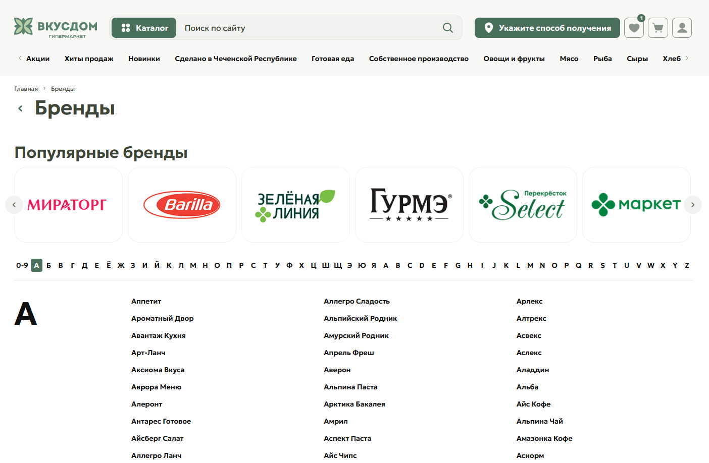

<div align="center">

# 🛒 ВкусДом — страница «Все бренды»

**Каталог брендов гипермаркета с алфавитным фильтром, слайдером популярных марок и полной адаптивностью.**

[](https://developer.mozilla.org/docs/Web/HTML)
[](https://developer.mozilla.org/docs/Web/CSS)
[](https://developer.mozilla.org/docs/Web/JavaScript)
[](https://swiperjs.com/)
[](LICENSE)

</div>

---

## 📸 Скриншот

<div align="center">



*Десктопная версия — популярные бренды и алфавитный каталог*

</div>

## ✨ Что на странице

<table>
<tr>
<td width="50%" valign="top">

### 🖥️ Десктоп

- **Хедер** — логотип, поиск с кнопкой «Каталог», выбор способа получения, иконки (избранное, корзина, ЛК), горизонтальное меню разделов со скроллом
- **Хлебные крошки** — «Главная → Бренды»
- **Популярные бренды** — слайдер с логотипами и стрелками
- **Все бренды** — фильтр по буквам в три колонки
- **Футер** — меню, приложения, подписка, контакты, соцсети

</td>
<td width="50%" valign="top">

### 📱 Мобильный

- **Хедер** — компактный логотип, поиск, бургер
- **Переключатель** «Доставка / Самовывоз»
- **Drawer-меню** с фокус-трапом и блокировкой скролла
- **Слайдер брендов** — компактные карточки
- **Фильтр по буквам** — разбит на строки
- **Футер** — аккордеонный, с бейджами приложений

</td>
</tr>
</table>

---

## 🛠 Стек

<div align="center">

| Слой | Технология |
|:---|:---|
| **Разметка** | HTML5, семантические теги, SVG-спрайт для иконок |
| **Стили** | CSS3, переменные (`--vkusdom-*`), Flexbox, Grid |
| **Логика** | Vanilla JS (ES5-совместимый, IIFE, без сборки) |
| **Слайдеры** | Swiper 11 (CDN) + нативный fallback через `scroll-snap` |
| **Шрифты** | Google Fonts — Geologica (400, 600) |
| **Изображения** | WebP с `srcset`/`sizes`, SVG для логотипов и соцсетей |
| **Интерактив** | IntersectionObserver (reveal), Pointer Events (ripple), `prefers-reduced-motion` |
| **SEO** | Open Graph, Twitter Cards, JSON-LD (`BreadcrumbList`, `CollectionPage`), `canonical` |
| **Доступность** | ARIA, focus-trap, skip-link, скрытие декоративных SVG |

</div>

> 📦 **Без сборщиков.** Никакого webpack / vite / gulp. Внешние зависимости — только CDN Swiper и Google Fonts.

## 📁 Структура

```
vkusdom-f-6/
├── index.html           # Страница целиком
├── css/
│   └── style.css        # Стили (CSS3 + переменные)
├── js/
│   └── main.js          # Логика (vanilla JS)
├── img/                 # Ассеты
│   ├── brand_N.png      # Исходники логотипов
│   ├── brand_N-115.webp # Мобильный слайдер
│   ├── brand_N-215.webp # Десктоп-слайдер
│   ├── brand_N-430.webp # Retina-версия
│   ├── badge-*.svg      # Иконки магазинов приложений
│   ├── social-*.svg     # Иконки соцсетей
│   └── logo_*.svg       # Логотипы ВкусДом
├── scripts/
│   ├── build-images.bat # Генерация WebP (Windows)
│   └── build-images.sh  # Генерация WebP (*nix)
└── README.md
```

**Пояснения:**

- **`index.html`** — единственная страница проекта.
- **`css/style.css`** — все стили в одном файле, CSS3 + переменные.
- **`js/main.js`** — вся логика без сборщиков и зависимостей.
- **`img/`** — исходники PNG + сгенерированные WebP.
- **`scripts/`** — вспомогательные утилиты для конвертации картинок.

## 🚀 Запуск

### Вариант 1 — просто открыть

Дважды кликни `index.html`.

VS Code: расширение Live Server → правый клик на index.html → Open with Live Server.

✅ Мобильное меню открывается на мобильном (< 768px)

✅ Фильтр по буквам переключает списки

✅ Tab-навигация не выходит за пределы открытого drawer

Исходные логотипы лежат в img/*.png. Скрипты создают три размера WebP: 115, 215 и 430 px.

Проект полностью статический — сборка не нужна.

📱 Проверено в браузерах
<div align="center">


</div>

📄 Лицензия
Распространяется под лицензией MIT. Подробнее — в файле LICENSE.

Сделано с 💚 для ВкусДом